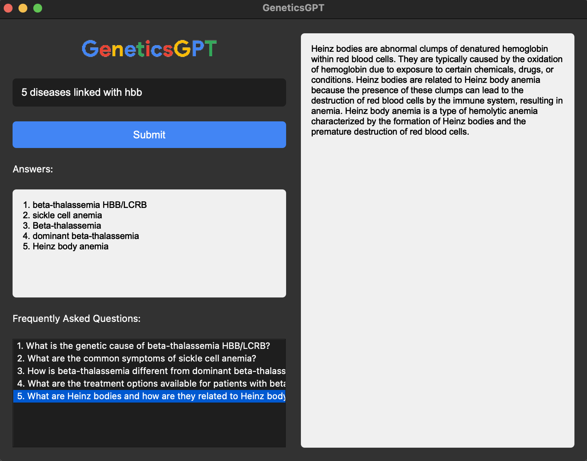

# 🧬 GeneticsGPT 🔬

GeneticsGPT is a powerful and intuitive application that leverages the OpenAI GPT-3.5-turbo model to provide insights and answers to genetic and disease-related questions. With its user-friendly interface and integration with the [Open Targets](https://platform.opentargets.org/) genetics database, this application makes it easy to explore and understand complex genetic information.

## DEMO



## 🌟 Features

- 💬 Ask questions related to genetics and diseases
- 🔍 Get detailed answers based on the Open Targets genetics database
- 📜 View a list of frequently asked questions (FAQs) generated based on the query response
- 🙋‍♀️ Click on an FAQ to get a concise and informative answer
- 🧠 Powered by the OpenAI GPT-3.5-turbo model for accurate and relevant responses

## 🚀 Getting Started

### Prerequisites

- Python 3.7 or higher
- OpenAI API key
- PyQt5 library
- requests library

### Installation

1. Clone the repository.

2. Install the required dependencies using pip.
   
3. Set up your OpenAI API key:
   - Sign up for an API key at [OpenAI](https://openai.com/).
   - Replace `"your-openai-api-key"` in the code with your actual API key.

### Usage

1. Run the application:
   ```
   python main.py
   ```

2. Enter your question related to genetics or diseases in the input field and click the "Submit" button.

3. The application will display the query response in the answer widget on the left side.

4. Generated FAQs will be listed below the answer widget. Click on an FAQ to view a concise answer in the answer text area on the right side.

5. Explore the generated FAQs and their answers to gain insights into the genetic and disease-related information.

## 💡 Why Open Targets

GeneticsGPT is a GPT-based search engine to translate natural language queries into valid GraphQL queries. This empowers users to easily explore and extract insights from the Open Targets dataset as currently Open Targets lacks a sophisticated search engine for complex queries, so this tool becomes very useful for drug discovery and genetics research.

## 📄 License

This project is licensed under the [MIT License](LICENSE).

## 🙏 Acknowledgments

- [OpenAI](https://openai.com/) for providing the powerful GPT-3.5-turbo model
- [Open Targets](https://www.opentargets.org/) for the genetics database and GraphQL API
- [PyQt5](https://pypi.org/project/PyQt5/) for the graphical user interface framework
- Inspired from cx0

## 🤝 Contributing

Contributions are welcome! If you have any ideas, suggestions, or bug reports, please open an issue or submit a pull request.

## TODO

- Add a discord chat bot (lets make it more accessible)

## 📧 Contact

For any questions or inquiries, please contact [owensingh72@proton.me](mailto:owensingh72@proton.me).

---

Please leave a star on the repository! 🧬✨
